# Blender

To use the tools created for Blender, you will need to set up the DLG asset library. Previously, assets needed to be appended, but this is now all handled through the Asset Browser.

- **Step 01**: Open ``Blender`` to navigate to the ``Edit`` tab.  
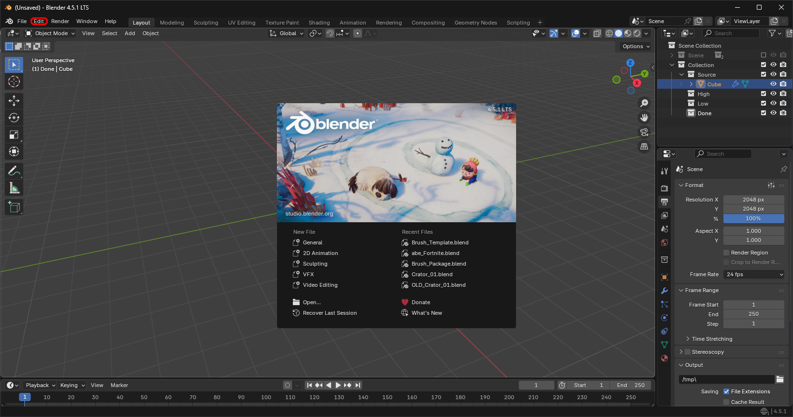

- **Step 02**: Open the ``Preferences`` window from the ``Edit`` dropdown.  
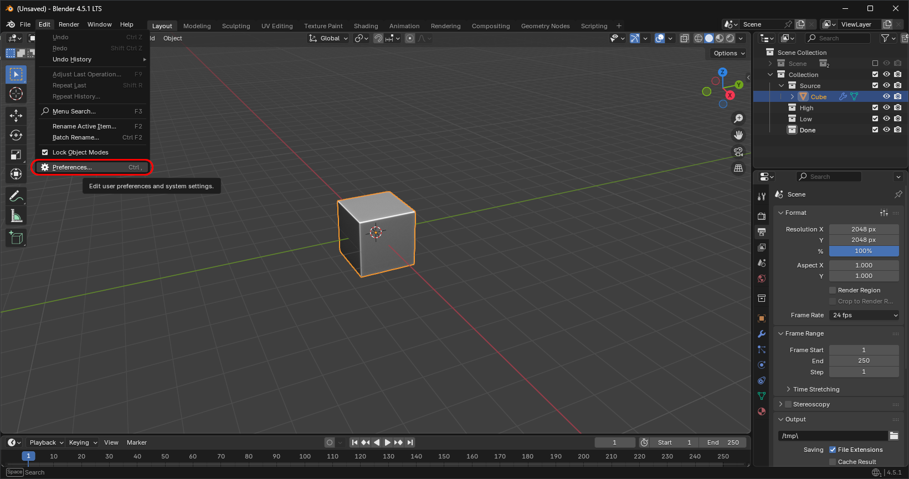

- **Step 03**: In the ``Preferences`` menu, head to the ``File Paths`` tab.  
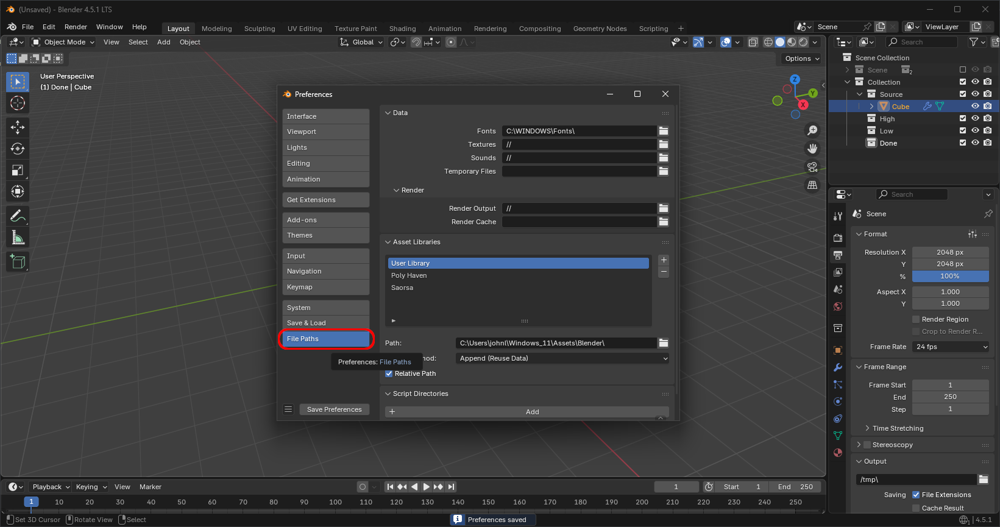

- **Step 04**: In the ``File Paths`` tab, go to the ``Asset Libraries`` menu and add a new asset library. When prompted for a path, point it to the ``Blender`` folder in the ``DLG_Tools`` repository. For example:  
`/home/johnlogostini/Gentoo/Source/DLG_Tools/Blender`  
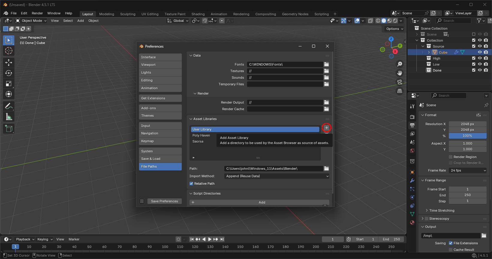

- **Step 05**: By default, Blender will name the library ``Blender``, so double-click the name and rename it to ``DLG Tools``.  
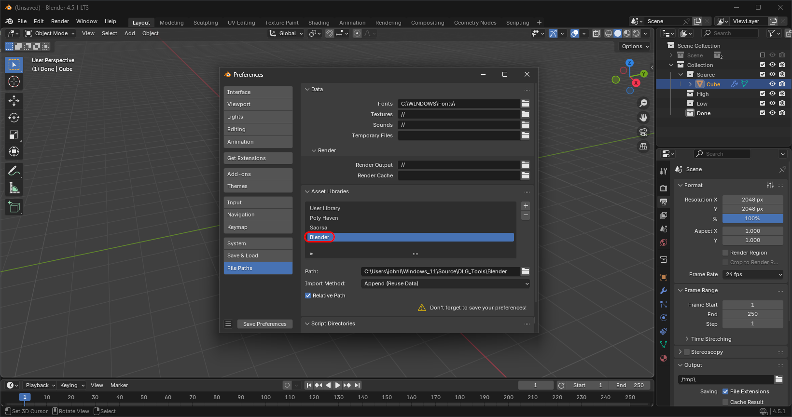

- **Step 06**: Save your settings and exit the ``Preferences`` menu. If auto-saving is enabled, the prompt to save will not appear and you don’t need to save manually.  
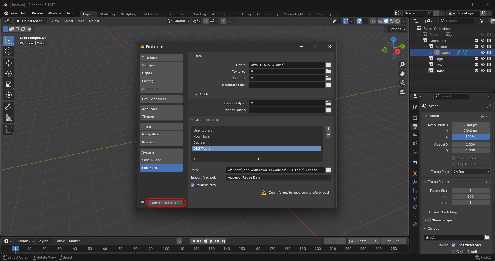

# Sculpting Setup

- **Step 01**: If you’re trying to use the sculpting brushes, once in ``Sculpting`` mode go to the ``Catalog Selector`` and open the dropdown.  
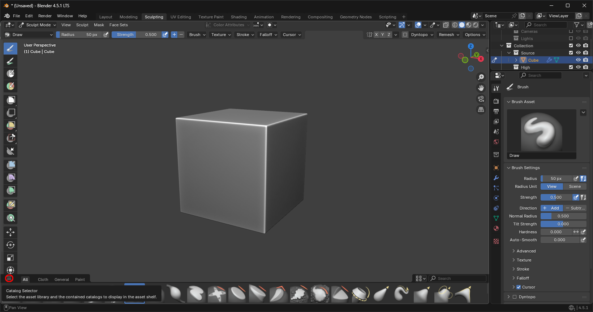

- **Step 02**: Enable the categories you want shown in the tab navigation bar. If you enable the ``Distant Light Games`` category, it will show all brushes included in DLG Tools.  
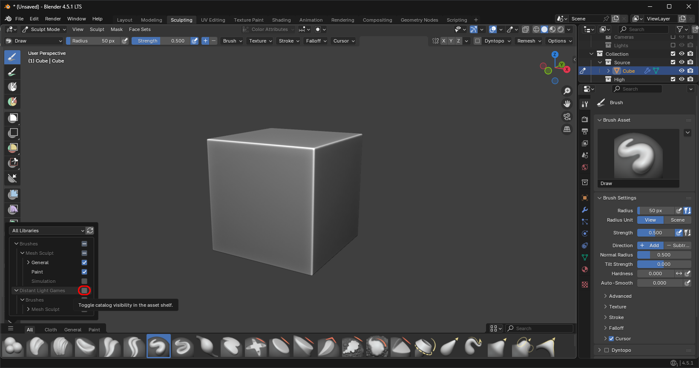

- **Step 03**: Navigate to the now visible tab (in this case ``Distant Light Tools``), and you’re all set for sculpting.  
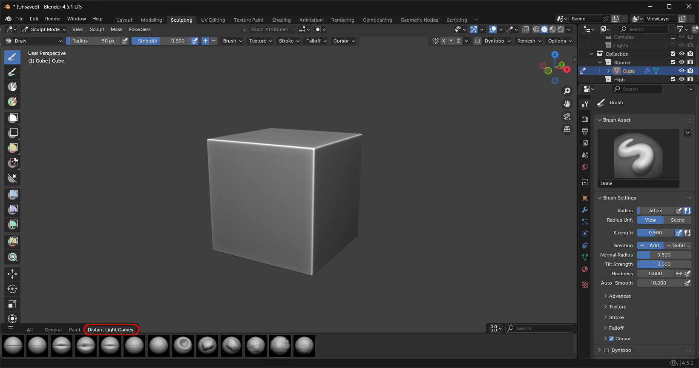

# Asset and Node Setup

- **Step 01**: If you’re looking to use any other asset type, you need to enable the Asset Browser. Start by splitting your view vertically and go to the ``Editor Type`` dropdown.  
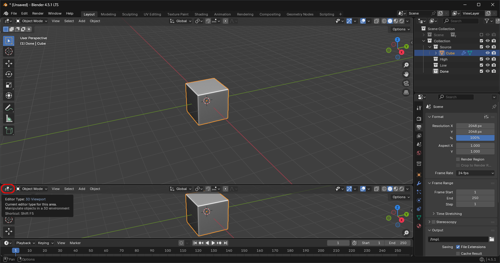

- **Step 02**: Navigate to the Asset Browser tab under the ``Data`` category and select it.  
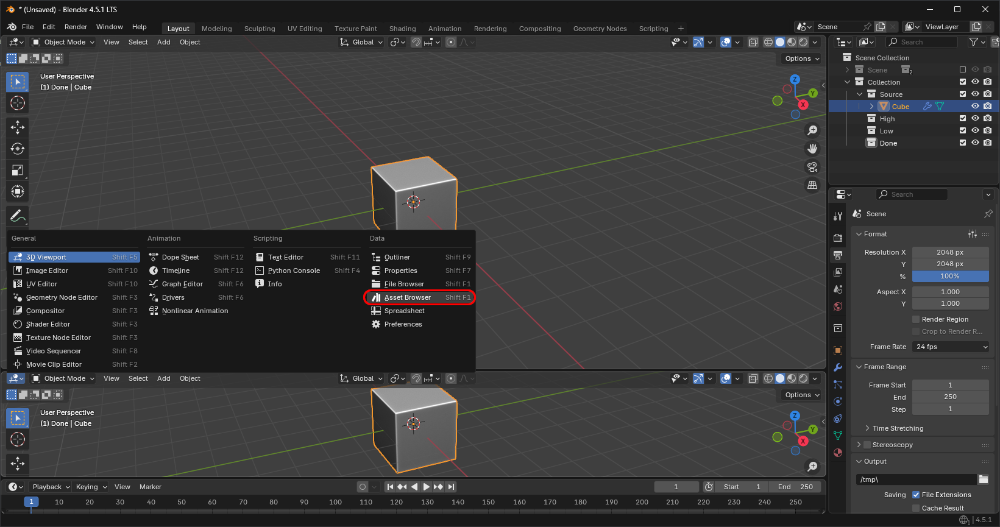

- **Step 03**: Navigate to the ``Library`` tab and open the dropdown.  
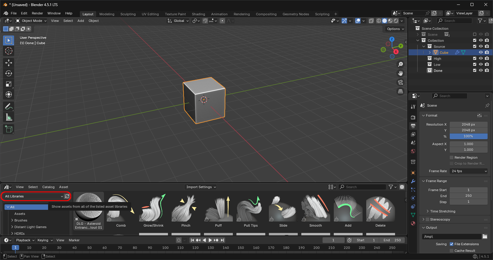

- **Step 04**: Select ``DLG Tools`` from the dropdown.  
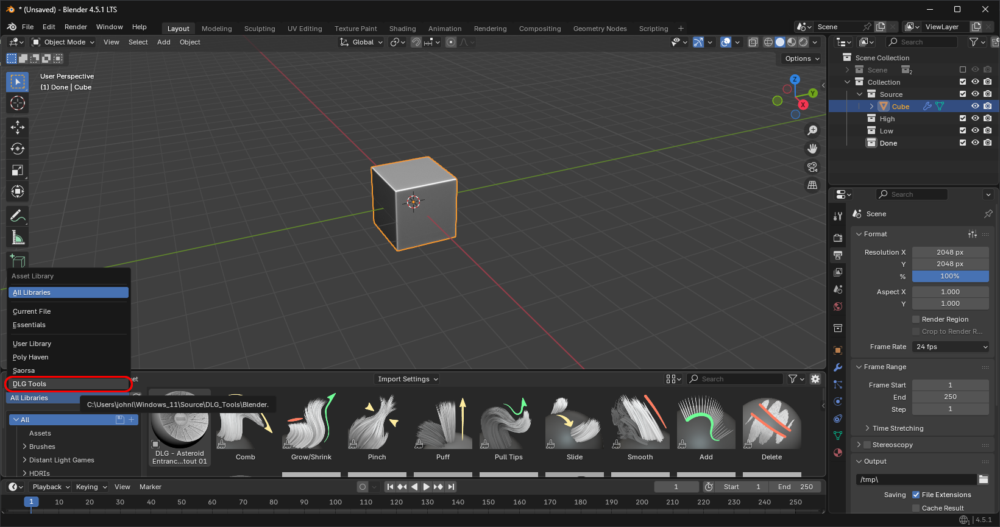

- **Step 05**: You’re all set. You can choose what category to display from the left, but all assets available in ``DLG Tools`` are available in this window.  
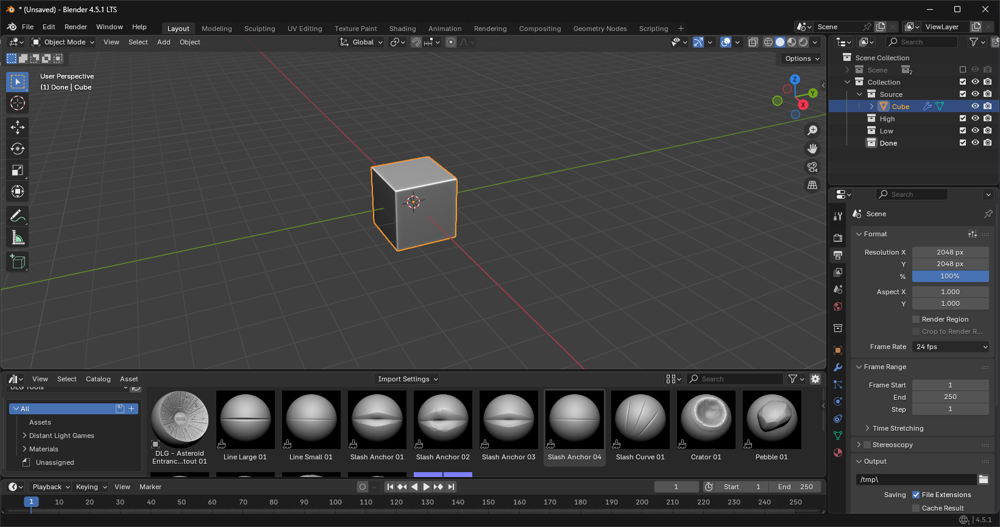
